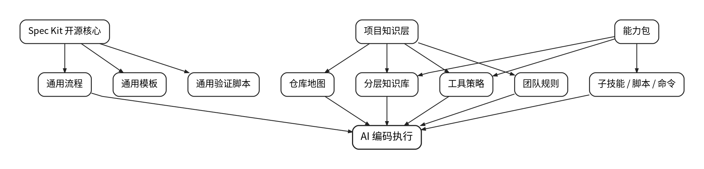
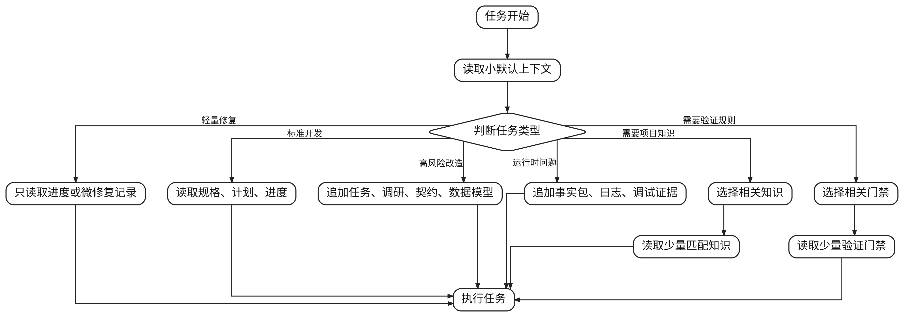
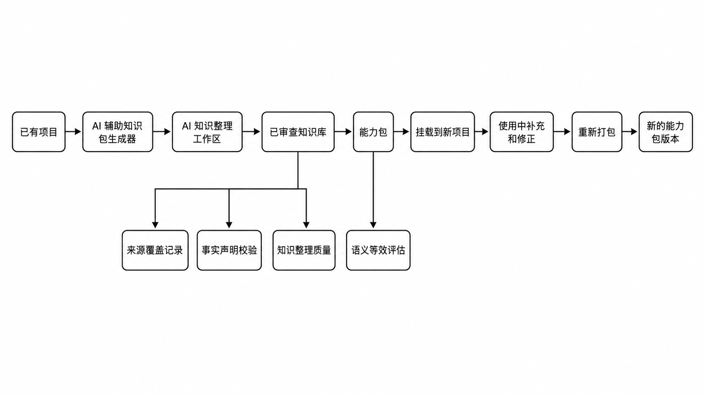

GitHub 推出的 [Spec Kit](https://github.com/github/spec-kit) 基于 [SDD](https://johng.cn/ai/sdd-spec-driven-development)。SDD，也就是 Spec Driven Development，核心是先写清楚规格，再进入实现。

它较好地解决了一部分 AI Coding 常见问题：

- 需求漂移
- 漏改
- 误改
- 交付不可复现

它的基本思路很清楚：不要让 AI 一上来就写代码，先写清楚原则、规格、计划和任务，再实现。

这比“有个需求，你直接改”更稳。
它让 AI Coding 从闲聊式开发，往工程化开发迈了一步。

但真正放到复杂项目里，很快会暴露一个问题：

> 通用 SDD 能把 AI 带进开发流程，但还不足以把 AI 带进真实工程现场。

真实工程现场里，不只有需求和代码。
还有仓库边界、团队规则、历史坑点、构建链路、运行时目录、验证环境、提交规范、验收证据、长期知识沉淀，以及大量“新人不知道就会踩坑”的隐性规则。

通用 SDD 解决的是“AI 如何按规格写代码”。
但它没有充分解决“AI 如何带着正确项目知识、正确验证链和可复用经验持续交付”。

所以我基于 Spec Kit 补了四类能力：

1. 项目融合能力
2. 交付闭环能力
3. 上下文治理能力
4. 知识复用能力

下面按这四块展开。

---

## 一、项目融合不足

Spec Kit 的强项是“流程通用”。

它可以要求 AI：

- 先写 constitution，也就是项目原则
- 再写 spec，也就是需求规格
- 再写 plan，也就是实现计划
- 再拆 tasks，也就是任务清单
- 最后 implement，也就是进入实现

这套流程对很多项目都有价值。

但问题也在这里：**它过于通用**。

同样是“修一个 bug”，在不同项目里可能意味着完全不同的动作。

有的项目改源码后，还要同步运行时产物。
有的项目前端改完，必须进真实宿主验证。
有的项目有多个仓库，某些目录只是构建产物，不能当源码改。
有的项目有长期团队约定，不能靠 AI 扫目录自己猜。

如果 AI 只知道“我要按 spec 实现”，却不知道项目里的真实约束，它就容易做出看似合理、实际危险的操作。

### 通用 SDD 的典型问题

| 问题 | 表现 |
| --- | --- |
| 仓库角色不清 | AI 通过扫描目录猜哪个仓库该改 |
| 构建链路不清 | 只改源码，不知道还要同步产物或验证包 |
| 团队规则不清 | 忽略提交规范、验证规范、长期约束 |
| 历史坑点不清 | 重复踩已经踩过的坑 |
| 私有知识无法挂载 | 项目经验只能靠人临时提醒 |

这不是 AI 不聪明，而是它没有进入项目的真实知识层。

### 方案：分层知识库 + repository map + capability pack

我把项目知识从通用流程里拆出来，形成单独的知识层。

核心原则是：

> 开源核心只放通用工作流，项目知识放到 workspace-local `ai/knowledge/`，再通过 capability pack 挂载。

这里有两个概念需要先说明。

`repository map` 是仓库地图。
它用来告诉 AI：哪个路径是什么仓库，源码在哪里，构建产物在哪里，运行时目录在哪里，哪些目录不能直接改。

`capability pack` 是能力包。
它不是普通文档包，而是一组可以挂载到项目里的知识、规则、工具、脚本和提示词。

整体结构如下：



AI 不应该靠扫描源码猜仓库角色。
它应该先读明确的仓库地图。

这相当于给 AI 一张工程现场地图。

没有地图，AI 可能跑到临时目录里修“假代码”。
有地图，AI 至少知道哪里是源头，哪里是产物，哪里只是验证环境。

这也能减少现场扫代码的 token 消耗和时间成本。

### 能力包的意义

如果项目知识只存在本地，并且和 Spec Kit 强耦合，复用价值仍然有限。

真正需要解决的是：

> 一个项目沉淀出的经验，怎么迁移给另一个项目？

所以我设计了 capability pack。

一个 pack 不只是几篇 Markdown，而是一个可挂载的能力包：

```text
knowledge-pack/
├── knowledge-pack.yml          # 知识包清单：pack id、版本、描述、依赖、入口和元信息
├── ai/knowledge/               # 分层知识库：项目事实、领域规则、仓库说明、历史坑点、验证知识
├── capabilities/index.yml      # 能力索引：声明本 pack 暴露哪些 skills、tools、scripts、commands
├── skills/                     # 子技能：给 Codex 按任务触发加载的专用能力说明
├── tools/                      # 工具策略：MCP、脚本、外部工具的使用规则和边界
├── scripts/                    # 自动化脚本：输出 facts、blockers、unknowns、hints
├── commands/                   # 命令模板：pack 专属工作流命令、阶段提示或 slash-command
├── prompts/                    # 提示词模板：AI 任务提示、生成模板、审查模板
├── resources/                  # 低频资源：大文档、示例、图表、规范附件
├── profiles/                   # 项目画像：workspace.yml、repository-map.md 等
└── evaluation/                 # 评估材料：路由样例、golden case、语义等效评估和质量基准
```

这样，项目知识不再散落在聊天记录和零散文档里，而是变成可以挂载、更新、卸载、重新打包的工程资产。

---

## 二、交付闭环不足

通用 SDD 的主线通常到“代码实现”阶段后就弱化。

它能回答：

> AI 应该怎么从需求走到实现？

但复杂工程还需要回答另一个问题：

> 实现之后，怎么证明它真的能交付？本轮踩坑怎么沉淀为项目经验？

现实中，很多 AI Coding 没法一轮收敛，经常变成：

人工测试 → 反馈问题 → AI 修复 → 再测试 → 再反馈 → 再修复。

问题通常出在这些环节：

- 测试没跑全
- 验证环境不对
- 只验证了源码，没验证运行时
- 没有人类可读的验收摘要
- 提交时漏了配套文档
- 做完后没有复盘，下次继续踩坑

所以“写完代码”不是终点。
对工程交付来说，真正的终点至少包括：

1. AI 自己完成技术验收
2. 人类能快速判断验收结果
3. 提交前检查通过
4. 提交后做一次自检
5. 经验能回到知识体系

这可以借用一个说法：**[Loop Engineering（循环工程）](https://www.runoob.com/ai-agent/loop-engineering.html)**。

这里说的循环，不是让 AI 盲目多跑几轮。
而是让 AI 能规划、修改、观察结果、修复问题、完成验收，并把有效经验沉淀下来。

目标也不是完全取消人工参与。
更准确地说，是减少低价值人工介入，让人主要做关键验收和风险判断。

在一个 Electron 客户端工程里，这类闭环会更明显。
Electron 底层基于 Chromium，配合 CDP 和 Chrome-DevTools-MCP，AI 可以接管更多验证动作。

CDP 是 Chrome DevTools Protocol，可以让外部工具控制和观察浏览器行为。
MCP 可以理解为 AI 调用外部工具的一种协议入口。

借助这些能力，AI 可以完成更多自测动作：

- 启动应用
- 模拟点击
- 截图验收
- 读取页面状态
- 读取 CSS
- 读取 Console
- 根据自测结果继续修复
- 输出验收材料

### 通用 SDD 的典型问题

| 问题 | 后果 |
| --- | --- |
| implement 后弱化 | AI 容易写完就总结“已完成” |
| 验收材料不面向人 | reviewer 很难快速判断风险 |
| 缺少提交治理 | 代码、spec、验证证据可能不同步 |
| 缺少复盘回灌 | 同类问题下次还会重新踩 |
| 缺少后置自检 | 提交完成后才发现漏项 |

### 方案：从 implement 延伸到 acceptance、retrospective、commit

我把“交付”拆成更完整的链路：


这里有几个关键补强。

### 1. AI self-acceptance

AI 不能写完代码就直接说“请验收”。

它要先基于当前任务风险，自查这些问题：

- 改了什么
- 跑了什么验证
- 哪些验证没跑
- 没跑的原因是什么
- 是否存在 accepted gaps
- 是否有阻塞项
- 是否满足进入人工验收的条件

这里的 accepted gaps，指的是“已知但可接受的缺口”。
比如某些验证因为环境限制暂时无法执行，但风险已说明，并且不阻塞当前阶段。

核心目标是减少无效人工介入。

### 2. Human acceptance

工作流必须在这里停住。

AI 自验通过，不等于任务完成。
必须人工验收通过，才能继续进入后续阶段。

### 3. Retrospective

复盘看起来不直接产出代码，但对 AI Coding 很关键。

AI 犯过的错，如果不进入体系，下次大概率还会以类似方式再犯。

Spec Kit 的 retrospective 不是写总结感想，而是记录：

- 本次任务关键输入
- AI 做过哪些判断
- 哪些地方返工
- 哪些验证有效
- 哪些规则应该进入长期知识
- 哪些只是一次性经验，不能沉淀

这一步决定项目能不能越用越稳。

### 4. Commit + post-commit self-check

提交不是简单执行 `git commit`。

提交前要确认：

- 改动范围
- 验证结果
- 配套文档
- workflow state
- 验收证据

提交后还要做一次自检，避免“刚提交就发现漏文件”。

这就是交付闭环和普通代码生成的区别。

---

## 三、上下文治理不足：文档越长，AI 不一定越稳

通用 SDD 会自然产生很多文档：

- constitution
- spec
- plan
- tasks
- research
- data model
- contracts
- checklist

这些文档有价值。
但如果没有上下文治理，很快会变成另一个问题：

> 文档越来越多，AI 每次到底该读哪些？

很多人会下意识选择“全读”。

但全读不一定更安全。

上下文过大，会带来几个问题：

1. 旧 feature 的信息污染当前任务
2. 历史决策和当前事实混在一起
3. 低频工具规则挤占真正相关的代码上下文
4. AI 看似全面，实际跑偏
5. reviewer 不知道 AI 的判断依据来自哪里

### 通用 SDD 的典型问题

| 问题 | 表现 |
| --- | --- |
| 人类阅读成本高 | reviewer 不知道重点在哪里 |
| AI 默认加载过多 | 旧知识污染当前判断 |
| 缺少上下文预算 | 不知道哪些材料值得进入上下文 |
| 缺少按需选择机制 | 所有知识都靠 prompt 手工提醒 |

Spec 和 plan 很多时候更像 AI 的工作材料。
它们不一定适合人类快速验收、汇报或决策。

### 方案：小默认上下文 + 按需加载 + 人类摘要

我的基本原则是：

> 默认上下文要小，任务需要什么，再加载什么。

默认入口只要求读稳定材料：

```text
.specify/workspace.yml                 # 工作区定义：workspace 根、必需仓库、默认分支等
.specify/memory/repository-map.md      # 仓库地图：仓库/路径角色、边界、职责和路径分类
.specify/feature.json                  # 当前功能状态：当前 feature、分支、阶段和状态提示
ai/workflows/task-routing.md           # 任务路由规则：判断任务类型、加载材料和选择工作流路径
```

如果任务不是当前 feature，就不能把 `.specify/feature.json` 里的旧 feature 当成强上下文。
如果任务只是改 README，就不应该加载 runtime、CDP、native、plugin package 等大量无关知识。

选择逻辑大概如下：



这里分两个层次。

### 第一层：AI 工作上下文

AI 工作需要足够细。

实现复杂功能时，它确实需要 spec、plan、tasks，甚至 contracts 和 data model。

但这些材料不应该默认全量读取，而应该按任务风险加载。

### 第二层：人类阅读上下文

人类不应该被迫读 AI 的所有中间草稿。

所以我更强调：

- progress 记录当前状态
- validation evidence 记录验证证据
- acceptance 摘要面向验收
- retrospective 面向经验沉淀
- commit message 面向入库说明

本质上，是把“AI 工作材料”和“人类决策材料”分开。

AI 内部可以写得细。
但给人看的部分必须短、准、可审查。

---

## 四、知识复用不足

通用 SDD 能让一个 feature 的过程更规范。
但它对“长期知识复用”的处理还不够。

一个项目里可能积累了很多经验：

- 仓库怎么分工
- 哪些目录不能改
- 哪些脚本必须跑
- 哪些日志能证明问题
- 哪些验证环境才算有效
- 哪些历史坑点不能再踩
- 哪些 AI 行为需要特别约束

如果这些知识只停留在单个项目的文档里，就很难迁移到另一个项目。

更麻烦的是，知识不是静态的。
项目持续使用后，知识会被修正、补充、删除。
一个月后，项目里的知识可能已经比最初 pack 更准。

这时应该能重新打包，而不是靠人手工复制。

还有一个风险：如果长期经验都堆在 Spec Kit 内部，Spec Kit 会和某个项目知识库强耦合，反而难以部署到新项目。

### 通用 SDD 的典型问题

| 问题 | 后果 |
| --- | --- |
| 项目经验难迁移 | 每个项目都要重新教 AI |
| 知识更新不可控 | 文档散落，无法统一升级 |
| 知识卸载困难 | 过期知识残留在上下文里 |
| 缺少质量评估 | 不知道生成知识是否可信 |
| 缺少等效性判断 | 不知道 pack 挂载后是否接近原项目效果 |

### 方案：Capability Pack 生命周期 + AI generator + semantic eval

我的知识复用链路如下：



这里有三件事。

### 1. Pack 不是复制文件，而是封装能力

Capability Pack 可以包含：

- 知识
- 技能
- 工具
- 脚本
- 命令
- prompt
- 资源
- profile
- evaluation

它不是“文档包”，而是“AI 工作能力包”。

### 2. AI 生成知识必须有质量闭环

我不希望 AI 扫描项目后，生成一堆看似合理、实际不可验证的总结。

所以 generator 会产生：

```text
source-coverage-ledger.json        # 来源覆盖记录：统计知识生成时读取了哪些源码、配置和文档
claim-verification-report.json     # 声明校验报告：检查知识库中的事实声明是否有来源证据支撑
synthesis-quality-summary.md       # 生成质量摘要：评估知识库质量、缺口和风险
equivalence-summary.md             # 语义等效报告：对比挂载包与源知识库的接近程度
```

这些材料的意义是：
AI 可以总结，但必须留下来源、覆盖、未知项和质量评估。

### 3. 使用后的知识可以 repack

挂载 pack 之后，用户仍然可以继续完善知识库。

当这些知识变得更准、更完整后，可以用 repack 重新导出。

这样，知识不再是一次性初始化材料，而是可持续演进的工程资产。

---

## 小结

Spec Kit 的价值很明确：它把 AI Coding 从“直接改代码”拉回到“先规格、再计划、再实现”的工程流程里。

但在复杂工程里，仅有通用流程还不够。

AI 还需要知道：

- 当前项目的仓库边界
- 哪些知识必须默认加载
- 哪些知识只能按需加载
- 什么验证才算有效
- 交付证据如何留存
- 本轮经验如何回灌
- 项目知识如何迁移到下一个项目

所以我对 Spec Kit 的改造重点，不是把流程做得更复杂，而是补齐真实工程现场缺失的四层能力：

1. 项目融合
2. 交付闭环
3. 上下文治理
4. 知识复用

我的判断是：
AI Coding 真正要稳定下来，不能只靠更强模型，也不能只靠更长 prompt。

它需要工程现场地图、验证闭环和可复用知识体系。

否则 AI 能写代码，但很难持续稳定交付。

---

## 资源和使用

项目地址：[GitHub - spec-kit](https://github.com/liuminxin45/spec-kit)
